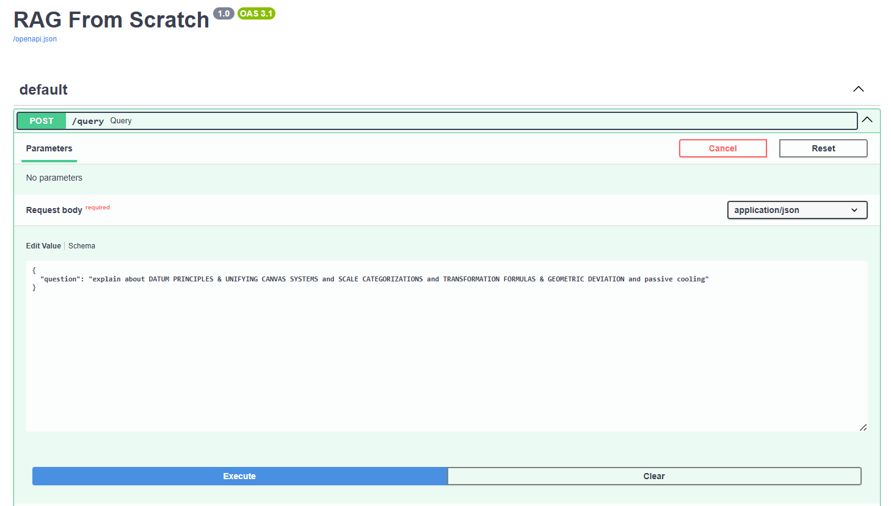
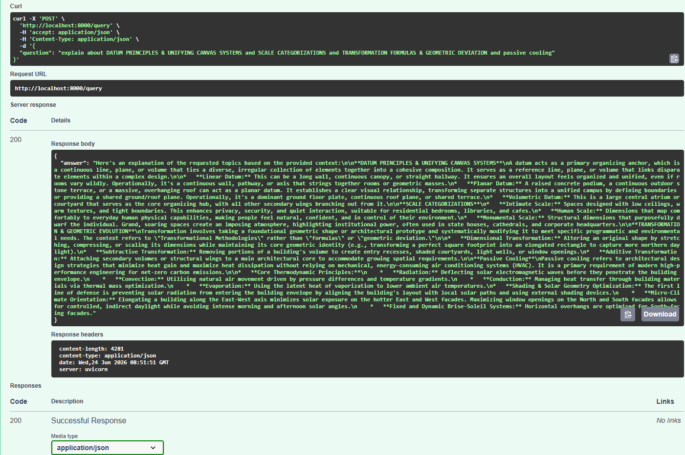
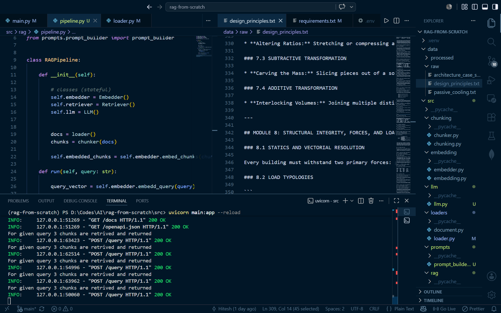

# RAG From Scratch

A Retrieval-Augmented Generation (RAG) system built completely from scratch using Python, FastAPI, Sentence Transformers, and Gemini.  

NO EXTERNAL FRAMEWORKS WERE USED

The goal of this project was to understand how modern RAG systems work internally by implementing each component manually instead of relying on frameworks such as LangChain, LlamaIndex, or managed vector databases.

---

## Project Goals

* Understand the complete RAG pipeline end-to-end
* Learn modular backend architecture (Classes and objects)
* Implement chunking manually
* Generate embeddings using transformer models
* Perform semantic retrieval using cosine similarity
* Build prompt construction logic
* Integrate an LLM for answer generation
* Expose the system through a FastAPI API

---

## Features

### Document Loading

* Loads raw text documents from the dataset directory
* Creates structured `Document` objects
* Preserves source metadata for traceability

### Chunking

* Fixed-size word chunking
* Configurable overlap between chunks
* Metadata propagation from document to chunk level

### Embeddings

* Uses `all-MiniLM-L6-v2`
* Generates dense semantic vector representations
* Supports both document and query embeddings

### Retrieval

* Manual cosine similarity implementation using NumPy
* Semantic search over embedded chunks
* Configurable Top-K retrieval

### Prompt Construction

* Injects retrieved context into prompts
* Preserves source information
* Grounds LLM responses using retrieved documents

### LLM Integration

* Gemini API integration
* Context-aware answer generation
* Hallucination reduction through retrieval grounding

### API Layer

* FastAPI implementation
* Swagger UI documentation
* Structured request and response models

---

## Architecture

```text
Raw Documents
      │
      ▼
Loader
      │
      ▼
Document Objects
      │
      ▼
Chunker
      │
      ▼
Chunks
      │
      ▼
Embedder
      │
      ▼
Embedded Chunks
      │
      ▼
Retriever
      │
      ▼
Relevant Chunks
      │
      ▼
Prompt Builder
      │
      ▼
Gemini LLM
      │
      ▼
Generated Answer
```

---

## Project Structure

```text
rag-from-scratch/
│
├── data/
│   ├── raw/
│   
├── src/
│   ├── main.py
│   │
│   ├── loaders/
│   ├── chunking/
│   ├── embedding/
│   ├── retrieval/
│   ├── prompts/
│   ├── llm/
│   └── rag/
│       └── pipeline.py
│
├── tests/
│
├── README.md
├── requirements.txt
└── pyproject.toml
```

---

## Technologies Used

* Python
* FastAPI
* Sentence Transformers
* NumPy
* Gemini API
* Pydantic
* Uvicorn

---

## API Endpoint

### POST `/query`

Request:

```json
{
    "question": "What is passive cooling?"
}
```

Response:

```json
{
    "answer": "Passive cooling refers to architectural design strategies that minimize heat gain and maximize heat dissipation without relying on mechanical cooling systems."
}
```

---

## Screenshots

### FastAPI Swagger UI

#### Query Endpoint



---

#### Response Example



---

### Server Terminal Execution by Uvicorn



---

## What I Learned

### Retrieval-Augmented Generation Fundamentals

* How RAG systems work internally
* Why retrieval improves LLM responses
* The role of context grounding

### Text Chunking

* Fixed-size chunking
* Overlapping chunk strategies
* Trade-offs between chunk size and retrieval quality

### Embeddings

* Semantic vector representations
* Transformer-based embedding models
* Query and document embedding workflows

### Vector Similarity

* Dot product
* Vector magnitude
* Cosine similarity calculations
* Top-K retrieval

### Backend Development

* FastAPI application design
* API schema validation using Pydantic
* Project modularization
* Clean architecture principles

### AI Engineering Concepts

* Context injection
* Prompt construction
* Retrieval pipelines
* LLM integration patterns

---

## Future Improvements

* Vector DB integration for efficient vector search
* BM25 keyword retrieval
* Hybrid search (Semantic + Keyword)
* Reranking models
* PDF document support
* Document upload endpoint
* Streaming responses
* Evaluation metrics (Precision@K, Recall@K, MRR)
* Docker deployment

---

## Running the Project

Clone the repository:

```bash
git clone <repository-url>
cd rag-from-scratch
```

Install dependencies:

```bash
pip install -r requirements.txt
```

Create a `.env` file:

```env
GEMINI_API_KEY=your_api_key_here
```

Start the FastAPI server:

```bash
uvicorn src.main:app --reload
```

Open Swagger UI:

```text
http://127.0.0.1:8000/docs
```

* remember to have some .txt files in data/raw

---

## Acknowledgements

This project was built as a learning-focused implementation to understand Retrieval-Augmented Generation systems from first principles without using higher-level RAG frameworks.
